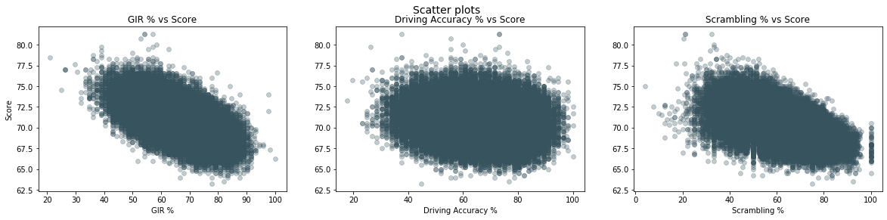

Nicole Hayashi's data science portfolio

# [Project 1: Are golfers focused on the right metrics?](https://github.com/nicolehayashi/golfmetrics/blob/master/golfmetrics.ipynb)
* Set of three experiments to determine if there was any statistical evidence that proved a player's greens in regulation percentage, driving accuracy percentage and scrambling percentage significantly impacted a golfer's score

# [Project 2: Who will win the 2020 Masters?](https://github.com/nicolehayashi/masterswinner/blob/master/2020masterswinner.ipynb)
* This project is paused until after earnings.  I created a quick model that needs to be tweaked and re-uploaded when I'm done.
